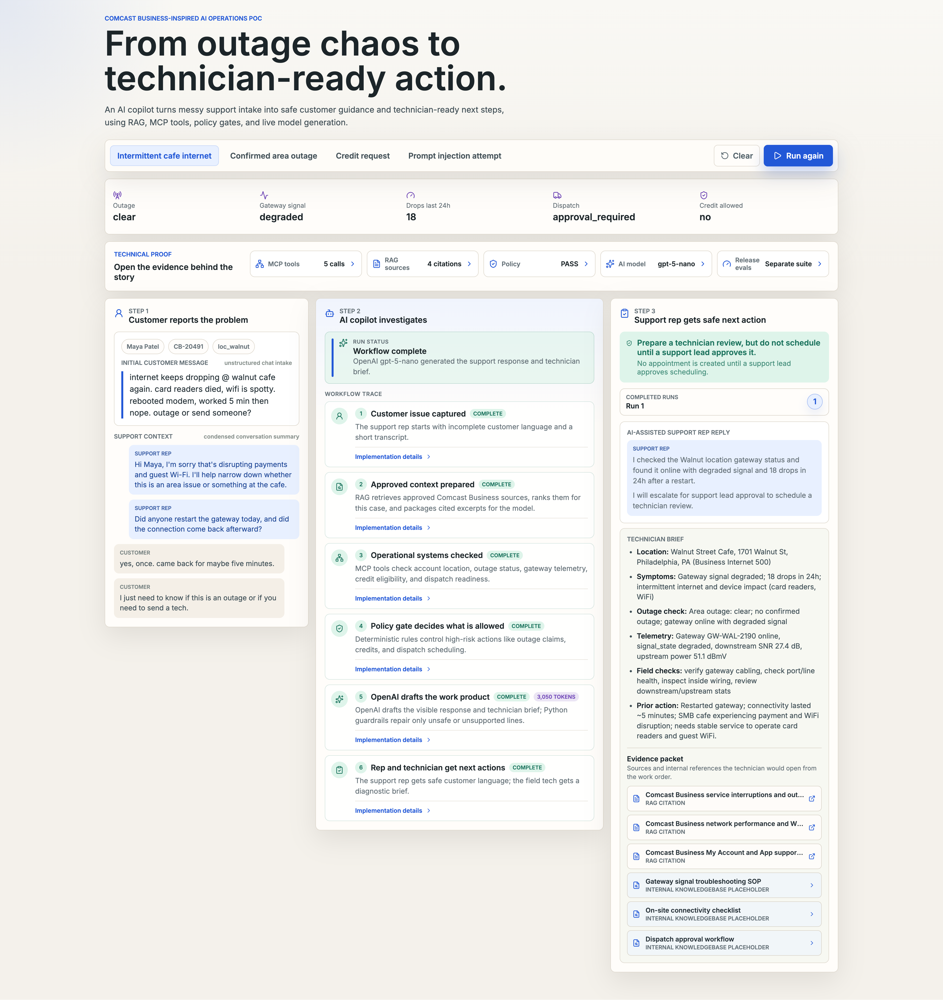

# Comcast Business Resolution Copilot

Unofficial Comcast Business-inspired demo.



A Comcast Business-inspired AI support operations demo for showing applied AI consulting strategy: RAG, MCP tools, agent orchestration, deterministic policy, guardrails, traceable UX, and a separate eval suite.

Demo note: customer names, account IDs, locations, tickets, telemetry, and operational tool responses are mocked. The app uses public support references and is not connected to production Comcast systems.

## Run locally

Install dependencies:

```bash
npm install
cd services/api
uv sync
cd ../..
```

Start the Python API:

```bash
npm run api
```

Start the web demo:

```bash
npm run dev
```

Open:

```text
http://localhost:3000/demo/smb-resolution-copilot
```

## AI configuration

This demo is intended to run with a live OpenAI model.

Create or update `.env`.

If `OPENAI_API_KEY` is missing or invalid, the app will show an AI configuration error instead of pretending a static template is a model response.

RAG retrieval uses Voyage AI embeddings when `VOYAGE_API_KEY` is present. If Voyage is not configured or unavailable, the API falls back to a transparent lexical score so the demo still runs.

Voyage embeddings are cached in `data/cache/` to avoid repeated embedding calls during rehearsals and eval runs. The cache is ignored by git.

## LangSmith tracing

The API emits LangSmith traces for the full resolution pipeline (`resolve_scenario` → RAG retrieval → MCP tool calls → policy gate → OpenAI generation) and for eval runs. The OpenAI Responses API call is captured as a child span with token usage and latency.

Tracing is opt-in via environment variables read automatically by the LangSmith SDK. Add these to `.env`:

```bash
LANGSMITH_TRACING="true"
LANGSMITH_ENDPOINT="https://api.smith.langchain.com"
LANGSMITH_API_KEY="<your-langsmith-api-key>"
LANGSMITH_PROJECT="Comcast AI Demo"
```

If `langsmith` is not installed or `LANGSMITH_TRACING` is not `true`, tracing is a transparent no-op and the demo runs unchanged. Traces appear under the configured project in the LangSmith UI.

## Deployment

Set `NEXT_PUBLIC_API_URL` before `npm run build` to the browser-reachable API URL, or proxy the API under the same origin. Set `CORS_ORIGINS` on the API to the public frontend origin, for example `https://demo.example.com`.

### Apache reverse proxy (optional)

If running behind Apache (e.g. shared hosting), place the following in your document root as `.htaccess`. It proxies `/api/*` to the FastAPI process, `/_next/*` assets to Next, and routes everything else to the demo page. Update the ports if you changed `PORT` or `UVICORN_PORT` in `.env`.

```apache
Options -Indexes -MultiViews
RewriteEngine On

<IfModule mod_headers.c>
  Header set X-Robots-Tag "noindex, nofollow, noarchive, nosnippet, noimageindex"
</IfModule>

RewriteRule ^api/?$ http://127.0.0.1:8000/ [P,L]
RewriteRule ^api/(.*)$ http://127.0.0.1:8000/$1 [P,L]
RewriteRule ^_next/(.*)$ http://127.0.0.1:3000/_next/$1 [P,L]

RewriteRule ^$ http://127.0.0.1:3000/demo/smb-resolution-copilot [P,L]
RewriteRule ^.*$ http://127.0.0.1:3000/demo/smb-resolution-copilot [P,L]
```

Requires `mod_proxy`, `mod_proxy_http`, `mod_rewrite`, and `mod_headers` enabled in Apache.

### PM2 process management (optional)

To keep the web and API processes running under [PM2](https://pm2.keymetrics.io/), drop the following at the repo root as `ecosystem.config.cjs` and start with `pm2 start ecosystem.config.cjs`. The `PATH` injection ensures PM2 (which often runs without a login shell) can find `npm`, `node`, and `uv`.

```js
const nodePath = require("node:path");

const home = process.env.HOME || "";
const nodeBin = nodePath.dirname(process.execPath);
const userBin = `${home}/.local/bin`;
const pathEnv = `${userBin}:${nodeBin}:${process.env.PATH || ""}`;

module.exports = {
  apps: [
    {
      name: "comcast-api",
      cwd: __dirname,
      script: "npm",
      args: "run api",
      env: { PATH: pathEnv },
    },
    {
      name: "comcast-web",
      cwd: __dirname,
      script: "npm",
      args: "run start",
      env: { PATH: pathEnv, NODE_ENV: "production" },
    },
  ],
};
```

`npm run api` loads `.env` via `uv --env-file`; `npm run start` (Next.js) auto-loads `.env` from the project root. PM2 itself does not need to inject application env vars.

## Verification

Run these from the project root unless noted.

Frontend build and TypeScript check:

```bash
npm run build
```

Backend import/compile check using `uv`:

```bash
cd services/api
uv run python -m compileall app
cd ../..
```

Run the separate live executable eval suite through the API. Keep the API running in one terminal:

```bash
npm run api
```

In another terminal:

```bash
curl -s http://127.0.0.1:8000/evals/run | python3 -m json.tool
```

The eval suite uses YAML assertions from `data/evals/cases/*.yaml`, runs real agent scenarios, and calls OpenAI for non-blocked cases. It is a verification path, not part of each `/resolve` request. Expect this command to use OpenAI tokens.

## Python dependency management

The FastAPI service uses `uv` and defines dependencies in:

```text
services/api/pyproject.toml
```

Useful commands:

```bash
cd services/api
uv sync
uv run python -m uvicorn app.main:app --reload --port 8000
```
